# Vandyshev-21-K-AS1 Protected Workstation Audit Service

**Отчет по дисциплине "Технология проектирования автоматизированных систем в защищенном исполнении"**

> Тема работы: разработка и деплой веб-сервиса для аудита защищенности рабочих станций.

## Паспорт работы

| Параметр       | Значение                                      |
|----------------|-----------------------------------------------|
| Проект         | `vandyshev-protected-workstation-audit-service` |
| Репозиторий    | `vandyshev-21-k-as1-protected-workstation-audit` |
| Исполнитель    | Вандышев Р.Ю.                    |
| Группа         | 21-К-АС1                                           |
| Дата           | 21.06.2026                                    |
| GitHub         | https://github.com/Sh1rok/vandyshev-21-k-as1-protected-workstation-audit |


## 1. Цель работы
Демонстрация полного DevOps-цикла: FastAPI → Docker → Yandex Cloud (Terraform) → Kubernetes.

## 2. Структура репозитория


## 3. Описание API
## Описание API

| Метод | Путь | Назначение |
|-------|------|------------|
| GET   | `/`  | Главная страница сервиса |
| GET   | `/health` | Проверка состояния приложения |
| GET   | `/workstations` | Список всех рабочих станций |
| GET   | `/workstations?department=...` | Фильтрация по подразделению |
| GET   | `/workstation/{hostname}` | Поиск рабочей станции по имени |
| GET   | `/audit-ready` | Список станций, готовых к защищенному контуру |
## 4. Локальный запуск без Docker
1) Создание виртуального окружения
```bash
python -m venv venv
```
2) Активация
```bash
venv\Scripts\activate
```
3) Установка зависимостей
```bash
pip install -r requirements.txt
```
4) Запуск сервиса
```bash
uvicorn app:app --reload --host 0.0.0.0 --port 8000
```
Проверка через:
```bash
curl http://127.0.0.1:8000/
curl http://127.0.0.1:8000/health
curl http://127.0.0.1:8000/workstations
curl http://127.0.0.1:8000/audit-ready
```
Swagger UI будет доступен по адресу:
```bash
http://127.0.0.1:8000/docs
```
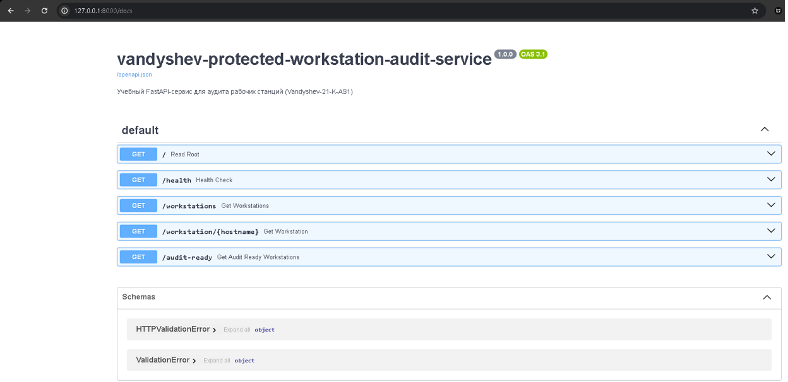
## 5. Docker

Сборка докер образа:
```bash
docker build -t protected-workstation-audit-service .
```
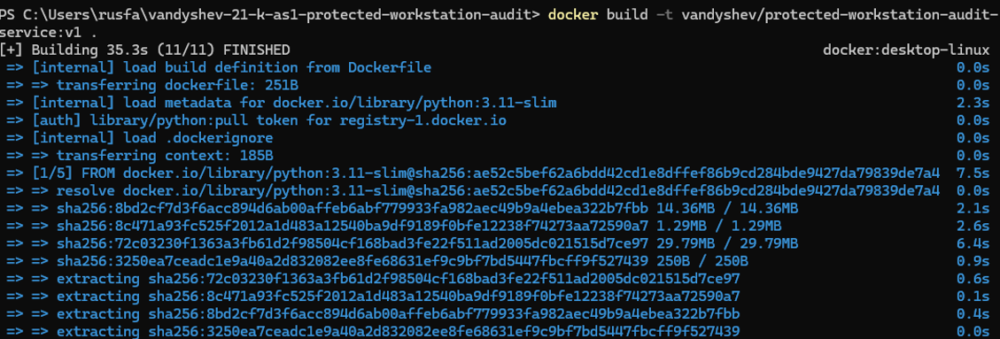
Запуск и проверка контейнера:
```bash
docker run -d --name audit-service -p 8001:8000 vandyshev/protected-workstation-audit-service:v1
```
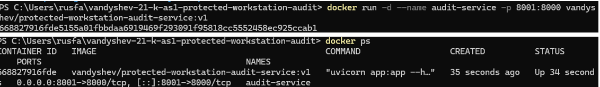
```bash
curl http://localhost:8001/health
```
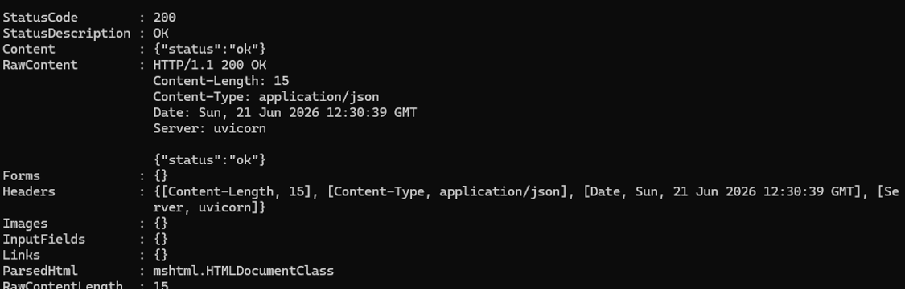
Публикация на DockerHub
```bash
docker login
docker tag vandyshev/protected-workstation-audit-service:v1 vandyshev/protected-workstation-audit-service:v1
docker push vandyshev/protected-workstation-audit-service:v1
```
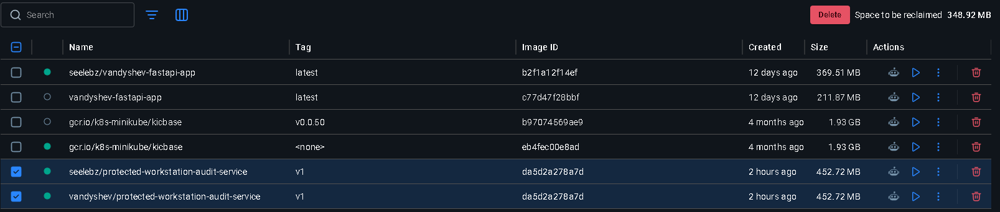
## 6. Terraform + Yandex Cloud
1)Создали файл terraform.tfvars

2)Инициализировали и запустили
```bash
terraform init
terraform plan
terraform apply -auto-approve
```
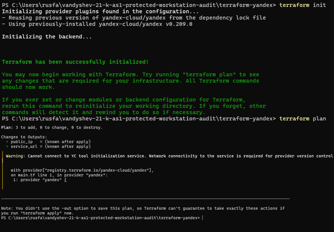

После выполнения Terraform покажет public_ip и service_url

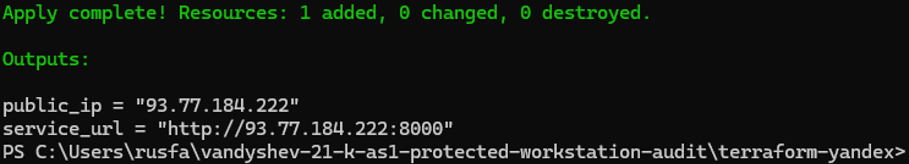

Проверить можно через:
```bash
curl http://IP_ИЗ_ВЫВОДА:8000/health
```
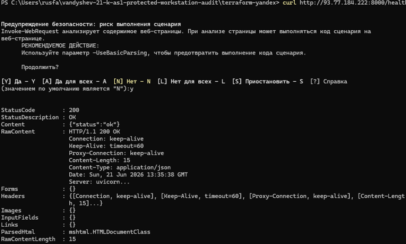

Консоль Yandex

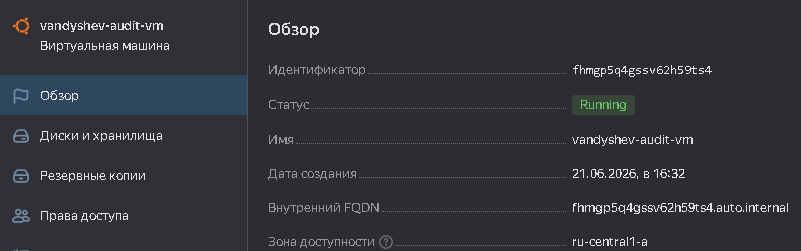

## 7. Kubernetes (Minikube)
1) Запускаем Minikube

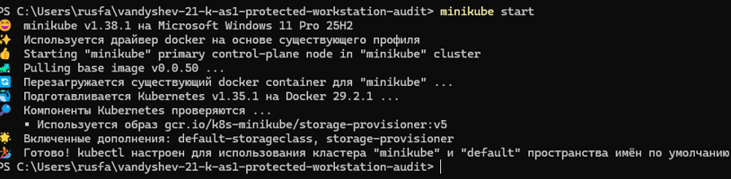

2)Применяем манифесты:

```bash
kubectl apply -f k8s/namespace.yaml
kubectl apply -f k8s/deployment.yaml
kubectl apply -f k8s/service.yaml
```
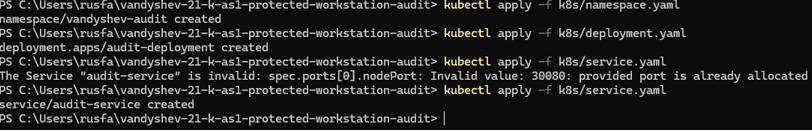

3) Проверяем:
```bash
kubectl get all -n vandyshev-audit
minikube service audit-service -n vandyshev-audit --url
```
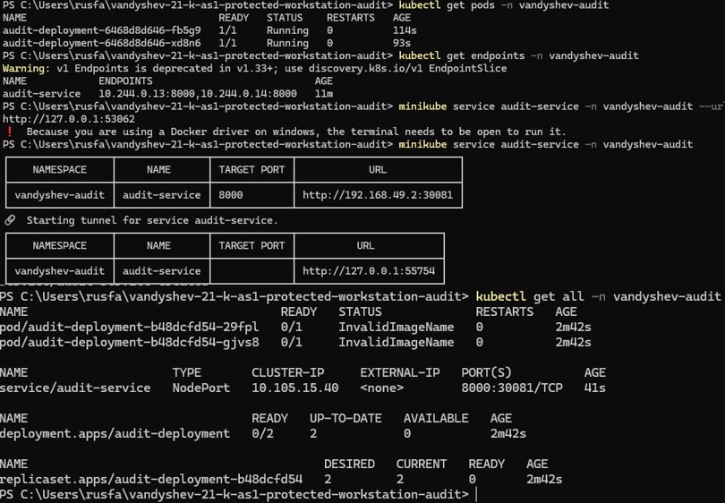

## 8. Проверка сервиса через YandexVM

1)Подключаемся к ВМ через SSH. Пример команды: 

```bash
ssh <имя_пользователя>@<публичный_IP-адрес_ВМ> -i <путь_к_приватному_ключу>
```
2) Для проверки работы аросматриваем контейнеры через:
```bash
sudo docker ps
```
А также логи (выводы) контейнера:

```bash
sudo docker logs
```
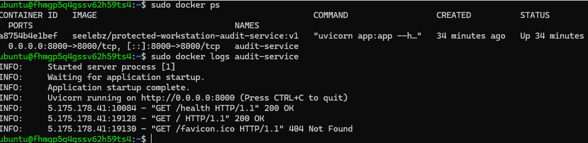

## 8. Команды для очистки окружения после выполнения всей работы

1) Docker:
```bash
docker stop audit-service && docker rm audit-service
```
2) Terraform
```bash
cd terraform-yandex && terraform destroy -auto-approve
```
3) Minikube
```bash
minikube delete
```
## 9. Безопасность 
Нельзя хранить в GitHub:

пароли и токены;

clouds.yaml;

.env;

terraform.tfvars с реальными значениями;

terraform.tfstate и backup state-файлы;

приватные SSH-ключи.

В репозиторий добавлен только terraform.tfvars.example с шаблонными значениями.
## 9. Выводы 
В ходе работы был создан учебный DevOps-проект для аудита защищённости рабочих станций. В проекте реализовано FastAPI-приложение, собран Docker-образ, с помощью Terraform описана инфраструктура в Яндекс.Облаке (Yandex Cloud), настроен cloud-init для автоматического развёртывания контейнера на виртуальной машине, а также подготовлены манифесты для запуска в Minikube.

Тестирование показало, что приложение работает локально, в Docker-контейнере, на виртуальной машине Яндекс.Облака и в Minikube.
