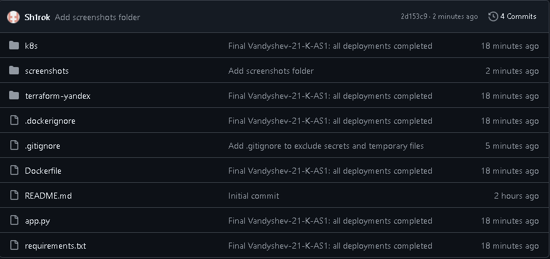
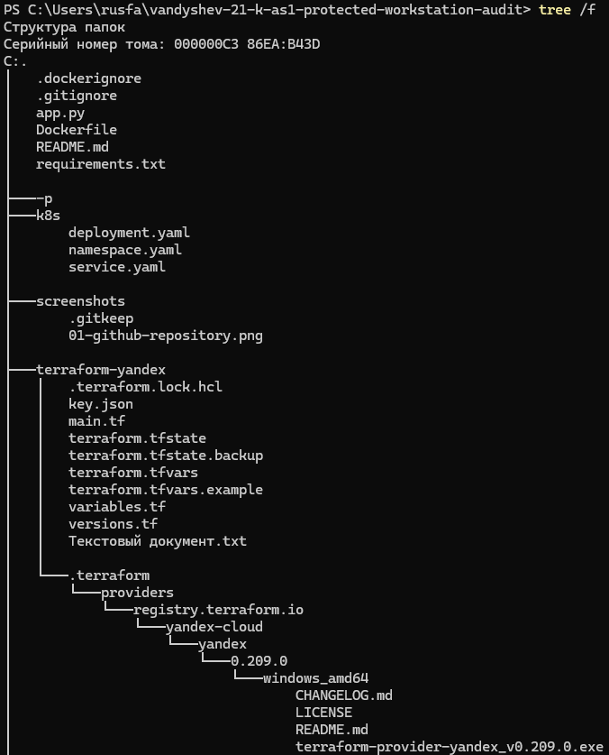

# Vandyshev-21-K-AS1 Protected Workstation Audit Service

**Отчет по дисциплине "Технология проектирования автоматизированных систем в защищенном исполнении"**

> Тема работы: разработка и деплой веб-сервиса для аудита защищенности рабочих станций.

## Паспорт работы

| Параметр       | Значение                                      |
|----------------|-----------------------------------------------|
| Проект         | `vandyshev-protected-workstation-audit-service` |
| Репозиторий    | `vandyshev-21-k-as1-protected-workstation-audit` |
| Исполнитель    | Вандышев Р.Ю.                    |
| Группа         | 21-К-АС1                                           |
| Дата           | 21.06.2026                                    |
| GitHub         | https://github.com/Sh1rok/vandyshev-21-k-as1-protected-workstation-audit |

## 1. Цель работы
Демонстрация полного DevOps-цикла: FastAPI → Docker → Yandex Cloud (Terraform) → Kubernetes.

## 2. Структура репозитория

## 3–13. Все разделы
(Скопируй структуру из оригинального README Гофмана и замени все названия, пути и скриншоты на свои.)

**Важно**: Добавляй скриншоты по мере выполнения (см. ниже).
